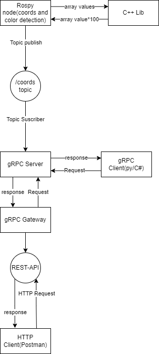

# M4-midterm
Repository for a gRPC server and client using ROS for color detection and image coordinates adquisition.
# Video demostration
https://www.youtube.com/watch?v=BmOSbtz3M_k
# Data Flow Diagram

