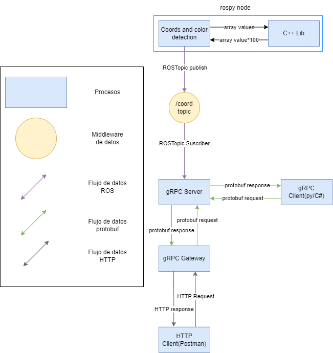
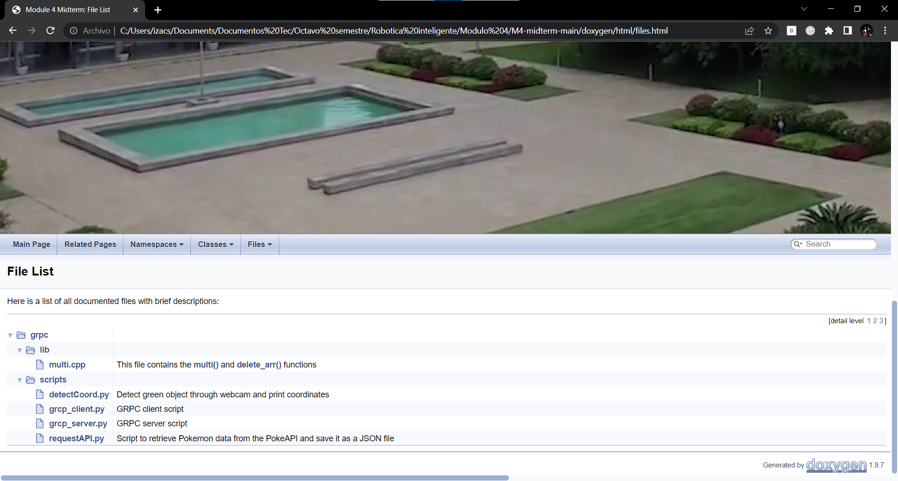

# M4-midterm
Repository for a gRPC server and client using ROS for color detection and image coordinates adquisition.
## Video demostration
https://www.youtube.com/watch?v=BmOSbtz3M_k
## Data Flow Diagram

## CORS uses and benefits
Cross-Origin Resource Sharing best known as CROS is a security policy for browsers that increases security and protection to users when accessing or loading resources from various origins.

It has the main feature of allowing controlled-access to CO(Cross-Origin) resources while preventing unauthorized access from unknown sources which in return allows modern web application access to resources from different domains.
Some of the key points as to why CORS is used are:

* Same-Origin Policy Enforcement
* Cross-Origin Resource Access
*	API Integration and Data Sharing
*	Authentication and Authorization
*	Security Considerations
*	Development and Testing

CORS is a technology that could prove extremely beneficial to an application that uses gRPC server and getaway since we are dealing with HTTPS requests and REST-API since it would provide the application with a secure way to fetch data from APIs and through HTTP.

## gRPC Service setup and execution
### Start image coordinates detector
1. To run start de server and use the client you first need need to create a catkin workspace and set up a ROS package
2. git clone https://github.com/salazarch/M4-midterm.git to the src directory of the package and then run in a separate terminal
```
roscore
```
After that, open a second terminal and run
```
cd M4-midterm/grpc/scripts
rosrun grpc detectCoord.py
```
Note: you may need to source devel/setup.sh in order for the rosrun to properly work
### Start gRPC Server
Open a new terminal in the same directory and run
```
python3 grpc_server.py
```
### Use gRPC Client
Open a new terminal in the same directory and run
```
python3 grpc_client.py
```
## gRPC Gateway setup and build
We asume Go and Protobuf is already install and added to the PATH
First we need to install some dependecies using go
```
go install github.com/grpc-ecosystem/grpc-gateway/v2/protoc-gen-grpc-gateway
go install github.com/grpc-ecosystem/grpc-gateway/v2/protoc-gen-openapiv2
go install google.golang.org/protobuf/cmd/protoc-gen-go
go install google.golang.org/grpc/cmd/protoc-gen-go-grpc
```
Then we navigate to the go path in our workspace
```
cd ./go/grpcgw/protos
```
The we use a proto file to generate go code
```
protoc -I ./protos -I /home/izacs/data/devel/googleapis --go_out ./protos --go_opt paths=source_relative --go-grpc_out ./protos --go-grpc_opt paths=source_relative rpc.proto
protoc -I ./protos --grpc-gateway_out ./protos --grpc-gateway_opt logtostderr=true --grpc-gateway_opt paths=source_relative rpc.proto
```
After the dependencies are done installing we go back one directory to
```
cd cd ./go/grpcgw
```
Then we need to initialize our module and fix for any other dependency
```
go mod init rest-gw.com/rest-gw
go mod tidy
```
Finally we build the gateway go code
```
go build go-gateway.go
```

## Doxygen documentation


The next file have been documented using doxygen format:

* multi.cpp
* detectCoord.py
* grpc_server.py
* grpc_client.py

Unfortunatly not all files were documented since some of them are not recommended to be edited or commented such as:

  * Proto file
  * Proto generated files
